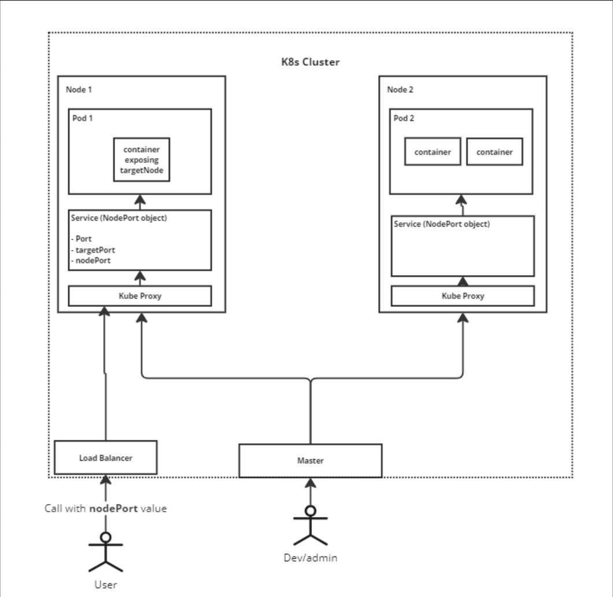

# simplek8s
This ReadMe is for notes on what I have learned about Kubernetes, they are not structured in any form or way just for my own refernce.

## A simple K8s Overview.
Kubernetes (K8s) is a software system for running multiple containers in set of multiple machines.

## Components That help work with k8s
- `minikube` for managing containers in the virtual machines. (creates a Node)
- `kubectl` for managing the virtual machines within the cluster. (k8s master/control-pane)

### Commands
`minikube start` starts a virtual machine that will be a Node in our cluster.
`minikube status` checks if there's any cluster started?

- `kubectl apply -f <filename>` - apply the configuration specified in the yaml into minikube node. (i.e create pod, services, etc)
- `kubectl get pods` - gets all objects of type Pod running.
- `kubectl get services` - gets all objects of type Service running.
- `minikube ip` - get the IP addresses of the minicube Node

## Kubernetes With NodePort.
Below is a typical Kubernetes cluster with that uses NodePort service as a means to expose the Pod and ultimately the container(s) in the pod to the outside world.

### Overview: 


#### Components Explained:
- `A K8s cluster` is a collection of K8s Nodes within a k8s ecosystem.
- A `Node` in K8s is a VM or physical machine that can run a bunch of containers within the K8s ecosystem. Each Node has it's own set of resources like CPU, Memory, etc.
- A `Pod` in k8s is an object that is responsible for running containers. A single pod can run more than one container (we usually have one container) but we can group related containers in the same pod.
- A `NodePort` is an object that is a network service within the K8s ecosystem that is responsible for exposing the container(s) within a Pod to the outside world. A `NodePort` has a reference to the Pod it is attached to.
- A `Kube-Proxy` is a component that every Node has and it is responsible for proxying requests from outside the Node to the relevant network handler service (in this example our NodePort)
- A `Load Balancer` is the entry point of the outside request to the k8s cluster. 
- A `Master` is a control plane that has capabilities like REST APIs that allow us to configure/manage the nodes in the k8s cluster.

### How some components look in code:

#### Pod
A pod is reponsible for running a container or group of containers. Here is how it would look:
```yaml
apiVersion: v1
kind: Pod
metadata:
  name: client-pod
  labels:
    component: web
spec:
  containers:
    - name: client
      image: khutsokobela/multi-client
      ports:
        - containerPort: 3000
```
We will highlight some important bits of the this configuration file used to build a pod in a K8s ecosystem.
- The `kind: Pod` tells kubectl what kind of K8s object we are creating in our Kubernetes ecosystem when we do `kubectl apply -f <file-name>`.
- The `lables -> component: web` is just a label we created so we can be able to reference this Pod in our K8s ecosystem. This could be anything like `lables -> myKey: myValue`
- The `spec` has an array of containers we want to run in this Pod.
- As suspected the `containers` property is the array for specifying images that we want to use in this pod.
- The `image` is for specifying the image we want to run in the container, if no full url of where the image is stored is given docker hub is a default source.
- `ports -> containerPort` is the port that the running container will be exposing, this should correspond to the port exposed by the built image. 

#### NodePort
The NodePort is just one of many ways to configure network into our k8s Node, below is code that describes the node port:
```yaml
apiVersion: v1 
kind: Service
metadata:
  name: client-node-port
spec:
  type: NodePort
  ports:
    - port: 3050 
      targetPort: 3000
      nodePort: 31515
  selector:
    component: web
```

- The `Kind: Service` tells our Kubernetes cluster that we want to build a network object within our K8s.
- `spec -> type: NodePort` tells Kuberentes that the type of network object we want is the NodePort; there can be others like `LoadBalance`, `ingress` etc.
- The `ports` discribe a number of ports that a pod that will be using this NodePort will be mapped to.
- The `port: 3050`is to be used by other objects in our K8s cluster to access the pod attached to this NodePort. 
- The `targetPort: 3000` is the port that is exposed by the running container (in our example [here](#nodeport) we used 3000 because the container will be using this to expose the app)
- The `nodePort: 31515` the port we will use to access the pod from the out side world this will be the port we use to hit i.e. `https://my-pod-url:31515 -> https://my-pod:3000`. This the url we will be using from outside the pod to access our container.
- `selector -> component: web` is used to find the object that is going to use this service. In our code it will be the node we created about with:  
```yaml
metadata:
  name: client-pod
  labels:
    component: web
```
These two files discussed are responsible for creating the K8s cluster with a one pod that has nodeport for networking. Running the following command starts up the K8s (assuming you have minikube and kubectl):

```bash
# creates and checks status of K8s cluster locally
minikube start 
minikube status

# create Pod object and network object
kubectl apply -f <filename-of-pod-config>.yaml
kubectl apply -f <filename-of-nodeport-config>.yaml

# Check created pod(s)
kubectl get pods

# Check created network services
kubectl get services

# get IP of minikube K8s cluster so you can call your node expose app
# if this spits https://some-minikube-url then to get hit app I will say: https://some-minikube-url:targetPort.
# In this case targetPort will be 3000 as seen in the above configs
minikube ip

```

#### How K8s Updates Objects (Internally)
Kubernetes uses the `name` and `kind` properties as an identifier for objects that are created within the Kubernetes cluster.
This means when I update the configuration file with the contents:
```yaml 
apiVersion: v1
kind: Pod # change to this results in new object created.
metadata:
  name: client-pod # change to this results in new object created.
  labels:
    component: web
spec:
  containers:
    - name: client
      image: khutsokobela/multi-client
      ports:
        - containerPort: 3000
```
Kubernetes will take `name: client-pod` and `kind: Pod` then look into the Nodes that are created if an object with the specified name and kind exists (i.e name: client-pod and Kind: Pod). If it finds such an object that is already created kubernetes will compare the config file given on `apply` with the config of the existing object, if not they are not the same Kubernetes master will find means to update whatever changed.

Each config file created is attached to an object with `name` and `kind`. If the `name` or `kind` change Kubernetes will create a new object regardless if it's the same yaml config file.

To check the details of an object in a cluster use:
```bash
# example: kubectl describe Pod client-pod
# omitting name-of-object will show all object of object-type example: kubectl describe Pod
kubectl describe <object-type> <name-of-object>
```

The pod config file doesn't allow for all properties to be changed, if we attempt to change the client-pod's containerPort we will see the following error:  
```bash
The Pod "client-pod" is invalid: spec: Forbidden: pod updates may not change fields other than `spec.containers[*].image`,`spec.initContainers[*].image`,`spec.activeDeadlineSeconds`,`spec.tolerations` (only additions to existing tolerations),`spec.terminationGracePeriodSeconds` (allow it to be set to 1 if it was previously negative)
  core.PodSpec{
        Volumes:        {{Name: "kube-api-access-xg74c", VolumeSource: {Projected: &{Sources: {{ServiceAccountToken: &{ExpirationSeconds: 3607, Path: "token"}}, {ConfigMap: &{LocalObjectReference: {Name: "kube-root-ca.crt"}, Items: {{Key: "ca.crt", Path: "ca.crt"}}}}, {DownwardAPI: &{Items: {{Path: "namespace", FieldRef: &{APIVersion: "v1", FieldPath: "metadata.namespace"}}}}}}, DefaultMode: &420}}}},
        InitContainers: nil,
        Containers: []core.Container{
                {
                        ... // 3 identical fields
                        Args:       nil,
                        WorkingDir: "",
                        Ports: []core.ContainerPort{
                                {
                                        Name:          "",
                                        HostPort:      0,
-                                       ContainerPort: 3000,
+                                       ContainerPort: 3001,
                                        Protocol:      "TCP",
                                        HostIP:        "",
                                },
                        },
                        EnvFrom: nil,
                        Env:     nil,
                        ... // 16 identical fields
                },
        },
        EphemeralContainers: nil,
        RestartPolicy:       "Always",
        ... // 28 identical fields
  }
```

This means some details like the name of container, ports can't be changed. This is a consequence of using the Pod object directly, to avoid this let's look at the Deployments objects.

## Other Pages
- [Deployments](../simplek8s/other-pages/Deployments.md)